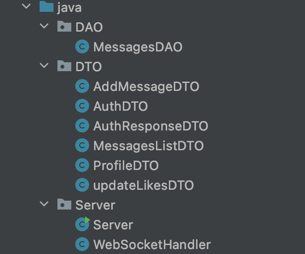

# sodaChat


https://sodachat.net
<br />
<sub><sup>Best viewed on a laptop/desktop.</sup></sub>

A live chat web application.


sodaChat is a fullstack web application built with React.js, Node.js, and Express.js for the frontend, and Java, Maven, Spark, WebSocket, and MongoDB for the backend.
It features a full login and auth system to sign in or create accounts, live messaging, and a like button.
It's deployed on an AWS EC2 instance, hosted on a domain from Google Domains, and SSL certified with LetsEncrypt.


### Backend Strucuture



Utilizes DTO and DAO design patterns.


### Local Install

```bash
# open backend folder in an ide such as intellij idea and build/run server main

# start local mongodb service

# cd into frontend folder in terminal and install node modules
npm i

# run frontend servers with pm2
pm2 start server.js wsServer.js

# now running on localhost
```
